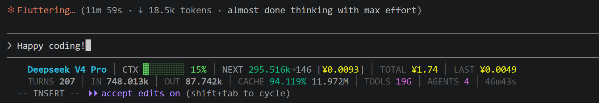

# Claude Code Statusline

[](LICENSE)
[](https://www.python.org/downloads/)

[**English**](README.md) | [中文](README.zh.md)

Production-grade custom statusline for [Claude Code](https://code.claude.com) optimised for **multi-provider** usage (DeepSeek, Anthropic, OpenAI, Gemini). Dual-line ANSI display with accurate cost calculation, JSONL-transcript-based token metrics, cache hit rate, compaction detection, and subagent aggregation.

## Why

Claude Code's built-in `cost.total_cost_usd` assumes Anthropic USD pricing. If you use DeepSeek (¥/CNY), Gemini, or OpenAI, the built-in cost is meaningless. More critically, `context_window.total_input_tokens` resets after each context compaction, making incremental snapshot-diff accumulation unreliable. This tool:

- Parses Claude Code's **on-disk JSONL transcript** directly for authoritative token counts
- Calculates cost using **actual provider pricing tables** (multi-currency, per-model)
- Shows **cache hit rate** as a proper 0–100% metric
- Detects and displays **compaction count** (`cN` suffix on turns)
- Estimates **next-turn replay tokens** to warn before context overflow
- Aggregates **subagent transcript tokens** (from `subagents/agent-*.jsonl`) into main session

## Display

```
DeepSeek-V4-Pro │ CTX ▓▓▓░░░░░ 38% │ NEXT 248.000k→150 [¥0.014] │ TOTAL ¥0.80 │ LAST ¥0.012
TURNS 47c2 │ IN 512.384k │ OUT 84.030k │ CACHE 96.351% 13.376M │ TOOLS 63 │ AGENTS 2/1r │ 57m35s
```



**Row 1:** Model name · context pressure (64-level gradient bar + %) · replay estimate with predicted cost · session cumulative cost · last-turn cost

**Row 2:** Turn count (`cN` = N compactions) · non-cache input tokens · output tokens · cache hit rate + absolute · tool calls · subagents (total/running) · session duration

Colour rules: green → yellow → red for context pressure (0–100%); green → yellow → red for cache health (inverted — high hit rate is green). 256-colour 64-level ANSI ramp.

### Metrics Reference

**Row 1** — context + cost:

| Field | Example | Meaning |
|-------|---------|---------|
| `MODEL` | `DeepSeek-V4-Pro` | Current model display name |
| `CTX ▓▓░░ 38%` | `CTX ▓▓▓░░░░░ 38%` | Context window pressure from transcript `context_len` (most recent API call total tokens). Immune to compaction reset. Green <50%, Yellow 50–80%, Red >80% |
| `NEXT` | `248.000k→150 [¥0.014]` | Estimated next-turn context = current `context_len` + avg per-turn growth delta. → projected output [predicted cost]. Yellow at >50%, red at >80% |
| `TOTAL` | `¥0.80` | Session cumulative cost. Summed from per-model breakdown, each priced at its own rate |
| `LAST` | `¥0.012` | Cost of the most recent API call. Uses stdin `current_usage`, not cumulative |

**Row 2** — session statistics:

| Field | Example | Meaning |
|-------|---------|---------|
| `TURNS` | `47c2` | Turn count. `cN` suffix = N context compactions occurred. No suffix = zero compactions |
| `IN` | `512.384k` | Total non-cache input tokens. Parsed from JSONL transcript, immune to compaction resets |
| `OUT` | `84.030k` | Total output tokens across all API calls |
| `CACHE` | `96.351% 13.376M` | Cache hit rate + absolute cache read tokens. Formula: `cache_read / (input + cache_read)`. Inverted colour—higher rate = greener |
| `TOOLS` | `63` | Tool call count (includes failures from `PostToolUseFailure` hook) |
| `AGENTS` | `2/1r` | Subagent events: total spawned / currently running (`r` suffix). Hides running count when zero |
| Duration | `57m35s` | Elapsed session time from `started_at` |

**CACHE note**: The percentage uses JSONL-parsed cache_read vs input, not snapshot values. Non-cache input (`IN`) excludes cache_read to avoid double-counting.

**NEXT estimation**: Adds average per-turn context growth delta (computed from successive API calls' `input+cache_read` totals in the transcript) to the current `context_len`. Falls back to snapshot accumulation when no transcript exists. Colour warning: yellow at >50% of context window, red at >80%.

## Quick Start

### macOS / Linux

```bash
git clone https://github.com/stofancy/claude-code-statusline.git
cd claude-code-statusline
bash install.sh
```

### Windows (PowerShell 7+)

```powershell
git clone https://github.com/stofancy/claude-code-statusline.git
cd claude-code-statusline
pwsh -File install.ps1
```

The installer creates a venv at `~/.claude/statusline/venv` (uses `Scripts/*.exe` on Windows, `bin/*` on POSIX) and prints a `settings.json` snippet with platform-correct paths. The snippet uses forward-slash `~/` paths because Claude Code invokes hooks through bash, which mangles Windows backslash paths.

The local clone is installed in **editable mode** (`pip install -e`), so editing the source and restarting is all you need — no reinstall step.

### Via pip

```bash
pip install git+https://github.com/stofancy/claude-code-statusline.git
```

Then merge the hook + statusline configuration into `~/.claude/settings.json` (see `examples/settings.json`). Restart Claude Code.

### Environment variables

| Variable | Effect |
|---|---|
| `CCS_LANG` | UI language — `en` (default) or `zh`. Falls back to `$LANG`/`$LC_ALL` if unset. |
| `CCS_CURRENCY` | Display currency — `USD`, `CNY`, `EUR`, `GBP`, `JPY`, `AUD`, `INR`, `HKD`, `SGD`, `KRW`, `CAD`, `CHF`, `TWD`. Overrides `display_currency` in `pricing.yaml`. Prices stay in `base_currency` (USD by default) and are converted via the `fx_rates` block. |
| `CCS_DEBUG` | When `1`, writes hook + cost-resolution debug to `~/.claude/statusline/debug.log`. |

## Requirements

- Python 3.11+
- `pyyaml` (auto-installed)
- SQLite3 (stdlib)

## Pricing

Built-in pricing table at `src/ccs/pricing.yaml`. Override with `~/.claude/statusline/pricing.yaml`.

All prices in **CNY (¥)** per million tokens.

| Provider | Model | Input | Cache Hit | Cache Write | Output |
|----------|-------|-------|-----------|-------------|--------|
| DeepSeek | V4-Pro (2.5× off) | 3.00 | 0.025 | — | 6.00 |
| DeepSeek | V4-Flash | 1.00 | 0.02 | — | 2.00 |
| DeepSeek | R1 | 4.00 | 0.25 | — | 16.00 |
| Anthropic | Opus 4.7 | 107.73 | 10.77 | 215.46 | 538.65 |
| Anthropic | Sonnet 4.6 | 21.55 | 2.15 | 43.09 | 107.73 |
| Anthropic | Haiku 4.5 | 7.18 | 0.72 | 14.37 | 35.91 |
| OpenAI | GPT-4o | 17.95 | 8.98 | — | 71.80 |
| OpenAI | GPT-4o-mini | 1.08 | 0.54 | — | 4.31 |
| OpenAI | GPT-5 | 8.98 | 1.80 | — | 71.80 |
| Google | Gemini 2.5 Pro | 8.98 | 0.89 | — | 35.91 |
| Google | Gemini 2.5 Flash | 1.08 | 0.11 | — | 4.31 |

DeepSeek V4-Pro 2.5× discount valid until 2026/05/31 23:59 Beijing time. Update `pricing.yaml` when it changes.

If you use USD-based providers, convert their prices to CNY and override via user pricing file, or set `default_currency: USD` and update provider prices accordingly.

## Documentation

Detailed documentation available in both languages:

- **English**: [Architecture](docs/en/architecture.md) · [Installation](docs/en/installation.md) · [Configuration](docs/en/configuration.md)
- **中文**: [架构](docs/zh/architecture.md) · [安装](docs/zh/installation.md) · [配置](docs/zh/configuration.md)

## Architecture

```
                        ┌─ Stop hook ───────────────────┐
                        ├─ PostToolUse ─── ccs-tracker ──┤
                        ├─ SubagentStart ── (hook events) ├── SQLite
                        └─ SubagentStop ─────────────────┘  (tool calls, subagent events)

Claude Code statusline tick (every 15s) → ccs-statusline
  ├── stdin JSON ─── model, cost, context_window, transcript_path
  ├── JSONL transcript ─── parse message.usage entries → dedup → per-model aggregation
  ├── subagents/agent-*.jsonl ─── aggregate subagent token usage
  ├── SQLite ─── write parsed values to sessions + model_usage tables
  └── stdout ─── 2-line ANSI text
```

### Modules

| File | CLI Entry | Purpose |
|------|-----------|---------|
| `statusline.py` | `ccs-statusline` | Orchestration: stdin → transcript → DB → render |
| `tracker.py` | `ccs-tracker` | Hook event collector → persist to SQLite |
| `db.py` | — | SQLite schema (4 tables), direct write, CRUD, cleanup |
| `cost.py` | — | Multi-provider pricing, per-model cost summation, model ID resolution |
| `transcript.py` | — | JSONL parsing, dedup, token metrics, subagent aggregation, replay estimation |
| `renderer.py` | — | 256-colour bars, token formatting, 2-line layout |
| `util.py` | — | Shared stdin JSON reader |
| `pricing.yaml` | — | Configurable provider pricing table |

### How Token Counting Works

Token statistics are read **directly from Claude Code's JSONL transcript** — the authoritative record of every API call. This avoids the three problems of snapshot-diff accumulation:

1. **Compaction oscillation**: `total_input_tokens` resets after compaction, causing phantom "new calls" on every tick during context refill. JSONL entries are immutable — compaction inserts a `compact_boundary` marker but never deletes historical entries.
2. **Multi-call merging**: Multiple API calls between 15-second ticks merge into one accumulation. JSONL records every call individually.
3. **cache_read double-counting**: The formula `per_call_total_input = input + cache_read` inflates input. JSONL separates `input_tokens` (non-cache) from `cache_read_input_tokens` (cache hit).

**Dedup strategy**: consecutive usage entries with identical `(input_tokens, output_tokens, cache_read_input_tokens, cache_creation_input_tokens)` are streaming duplicates — only the last in each group is kept. User messages break the consecutive chain to prevent cross-turn false dedup.

### How Subagents Are Aggregated

Claude Code stores subagent API calls in `subagents/agent-*.jsonl` files (under the same session directory as the main transcript). These files use the same JSONL format and are parsed identically.

Subagents often use a different model (e.g. `deepseek-v4-flash` for subagents vs `deepseek-v4-pro` for the main session). Each model's tokens are tracked independently and priced at its own rate — mixed-model sessions produce accurate cumulative costs.

## Configuration

### Hook Events

| Hook | Purpose |
|------|---------|
| `Stop` | Turn boundary marker |
| `PostToolUse` | Counts tool calls |
| `PostToolUseFailure` | Counts failed tool calls |
| `SubagentStart` | Tracks subagent spawn |
| `SubagentStop` | Tracks subagent completion |

### Environment Variables

| Variable | Purpose |
|----------|---------|
| `CCS_DEBUG=1` | Write raw hook data to `~/.claude/statusline/debug.log` |

## Database

Location: `~/.claude/statusline/usage.db` (SQLite, WAL mode).

| Table | Contents |
|-------|----------|
| `sessions` | Session metadata, cumulative token counters, turn count, tool/subagent counters |
| `model_usage` | Per-model `(session_id, model_id)` token breakdown for accurate cost calculation |
| `tool_calls` | Per-turn tool call records |
| `subagent_events` | Subagent start/stop events |

Sessions older than 30 days are auto-cleaned. Delete `usage.db` to reset all accumulated data.

## Troubleshooting

| Symptom | Fix |
|---------|-----|
| Statusline not showing | Verify `statusLine` config in `~/.claude/settings.json`, restart Claude Code |
| Cost shows `-` | Check `pricing.yaml` exists; verify model ID matches a pricing entry |
| NEXT shows `-` | Normal — no transcript in early session; populates after first response |
| CACHE unusually high/low | Cache hit rate is `cache_read / (input + cache_read)`; >90% is normal for DeepSeek |
| TURNS shows `cN` | Compaction count — normal, indicates how many times context was compacted |
| Numbers look wrong after restart | Delete `usage.db` to reset cumulative counters |

## Compatibility

- Linux (x86_64, aarch64)
- macOS (Apple Silicon, Intel)
- Windows (WSL2)
- Windows Terminal with ANSI support

## License

MIT
